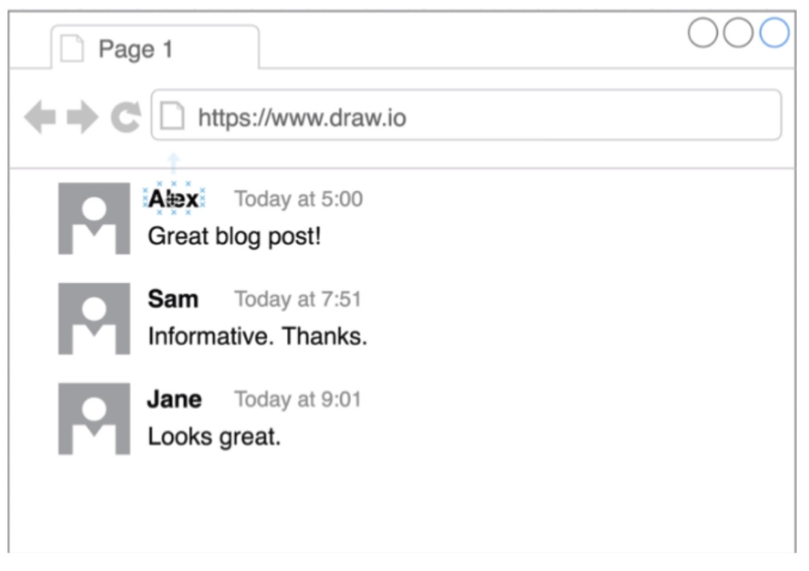

# Ejercicio comentarios



1. Vamos a usar el comentario de semantic

https://semantic-ui.com/views/comment.html

2. Tendremos que importar el css de semantic

Las librerías de css de semantic están en 
https://cdnjs.com/libraries/semantic-ui

El link tag es: 

```html
<link rel="stylesheet" href="https://cdnjs.cloudflare.com/ajax/libs/semantic-ui/2.4.1/semantic.min.css" integrity="sha256-9mbkOfVho3ZPXfM7W8sV2SndrGDuh7wuyLjtsWeTI1Q=" crossorigin="anonymous" />
```

El link debo copiarlo en el head del html

3. Crear con faker los comentarios (App.js)

> habrá que instalar la librería faker

tenemos por ejemplo:
- image.avatar
- nombre
- comentario (lorem)
- fecha

4. Crear un componente `Comentario.js` que tiene como parámetro (props) el comenario

Tiene que tener la [estructura que dice semantic](https://semantic-ui.com/views/comment.html)

5. Recorrer todos los comentarios y ponerlas en pantalla con `array.map`


